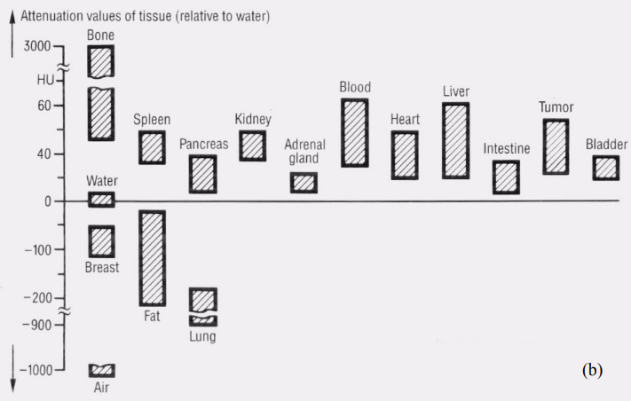

# Exercise 6 - Pixel classification and object segmentation (work in progress)

In the first part of this exercise, we will use pixel classification to label pixels in an image. In the second part, pixel classification will be combined with BLOB analysis to segment the spleen from a computed tomography (CT) scan.


## Learning Objectives

After completing this exercise, the student should be able to do the following:

1. Do Pixel classification
1. Implement, train and validate pixel classification algorithms based on minimum distance classification and parametric classification.
1. Define suitable classes given a set of input images and a goal for the segmentation.
1. Use the Matlab function \texttt{roipoly} to select regions in image that each represent a defined class.
1. Plot histograms and compute the average and standard deviations of the pixel values in each of the pre-defined classes.
1. Fit a Gaussian to a set of pixel values using the Matlab function \texttt{normpdf}.
1. Visualize and evaluate the class overlap by plotting fitted Gaussian functions of each pre-defined class.
1. Do pixel classification of an image using minimum distance classification.
1. Determine the class ranges in a parametric classifier by visual inspection of fitted Gaussian distributions.
1. Do pixel classification of an image using a parametric classifier.
1. Do colour classification by selecting class ranges in RGB space.
1. Visually evaluate colour classification by classifying unseen images.

## Installing Python packages

In this exercise, we will be using both [scikit-image](https://scikit-image.org/) and [OpenCV](https://opencv.org/). You should have these libraries installed, else instructions can be found in the previous exercises.

We will use the virtual environment from the previous exercise (`course02502`). 

## Exercise data and material

The data and material needed for this exercise can be found here: [exercise data and material]
(https://github.com/RasmusRPaulsen/DTUImageAnalysis/tree/main/exercises/ex6-PixelClassificationAndObjectSegmentation/data)

There are four training image and three test images. They have ground truth annotations of the spleen that we will use for training and testing of our algorithm.

## Abdominal computed tomography

The images in this  exercise are DICOM images from a computed tomography (CT) scan of the abdominal area. An example can be seen below, where the anatomies we are working with are marked. You should 

A CT scan is normally a 3D volume with many slices, but in this exercise, we will only work with one slice at a time. We therefore call one *slice* for an image.

In this exercise, we will mostly focus on the **spleen** but also examine the **liver, kidneys, fat tissue and bone.**


### Hounsfield units

The pixels in the images are stored as 16-bit integers, meaning their values can be in the range of [−32.768,  32.767]. In a CT image, the values are represented as [**Hounsfield units** (HU)](https://en.wikipedia.org/wiki/Hounsfield_scale). Hounsfield units are used in computed tomography to characterise the X-ray absorption of different tissues. A CT scanner is normally calibrated so a pixel with Hounsfield unit 0 has an absorbance equal to water and a pixel with Hounsfield unit -1000 has absorbance equal to air. Bone absorbs a lot of radiation and therefore have high HU values (300-800) and fat absorbs less radiation than water and has HU units around -100. Several organs have similar HU values since the soft-tissue composition of the organs have similar X-ray absorption. In the figure below (from Erich Krestel, "Imaging Systems for Medical Diagnostics", 1990, Siemens) some typical HU units for organs can be seen. They are, however, not always consistent from scanner to scanner and hospital to hospital. 




## Explorative analysis of one CT scan

Let us start by examining one of the CT scan slices from the training set. You can read the first slice like this:

```python
in_dir = "data/"
ct = dicom.read_file(in_dir + 'Training.dcm')
img = ct.pixel_array
print(img.shape)
print(img.dtype)
```

You should visualise the slice, so the organs of interest have a suitable brigthness and contrast. One way is to manipulate the minimum and maximum values proviede to `imshow`.

**Exercise 1**: *The spleen typically has HU units in the range of 0 to 150. Try to make a good visualization of the CT scan and spleen using (replace the question marks with values):*

```python
io.imshow(img, vmin=?, vmax=?, cmap='gray')
io.show()
```

An expert has provided annotations of **bone, fat, kidneys, liver and spleen**. They are stored as *mask* files which is an image with the same size as the input image, where the annotated pixels are 1 and the rest are 0. They are found as **BoneROI.png, FatROI.png, KidneyROI.png, LiverROI and SpleenROI.png**.

You can use the original image and a mask to get the values of the pixels inside the mask:

```python
spleen_roi = io.imread(in_dir + 'SpleenROI.png')
# convert to boolean image
spleen_mask = spleen_roi > 0
spleen_values = img[spleen_mask]
```

**Exercise 2**: *Compute the average and standard deviation of the Hounsfield units found in the spleen in the training image. Do they correspond to the values found in the above figure?*

**Exercise 3**: *Plot a histogram of the pixel values of the spleen. Does it look like they are Gaussian distributed?*


The function [`norm.pdf`](https://docs.scipy.org/doc/scipy/reference/generated/scipy.stats.norm.html) from `SciPy`  represents a Gaussian probability density function (PDF). It can for example be used to plot a Gaussian
distribution with a given mean and standard deviation.

This can be used to create a fitted Gaussian distribution of the spleen values:

```python
n, bins, patches = plt.hist(spleen_values, 60, density=1)
pdf_spleen = norm.pdf(bins, mu_spleen, std_spleen)
plt.plot(bins, pdf_spleen)
plt.xlabel('Hounsfield unit')
plt.ylabel('Frequency')
plt.title('Spleen values in CT scan')
plt.show()
```

Here `mu_spleen` and `std_spleen` are the average and standard deviation of the spleen values.


## Pixel Classification


## DICE Score


## References

- [Normal distribution](https://docs.scipy.org/doc/scipy/reference/generated/scipy.stats.norm.html)
- [DICE dissimilarity](https://docs.scipy.org/doc/scipy/reference/generated/scipy.spatial.distance.dice.html)

